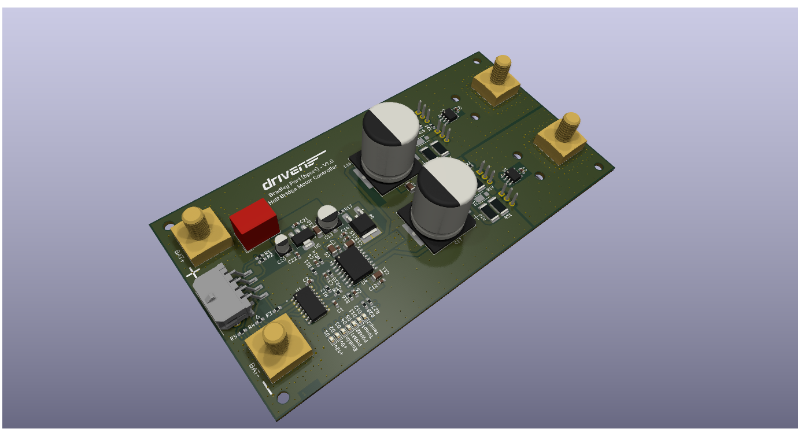

# Half-Bridge Motor Controller — Driven ESAC

A custom half-bridge motor controller designed for a GreenPower electric race car, built for the Driven Electric Student Automotive Competition (ESAC) team. Designed to replace the team's off-the-shelf PORTER-10 controller, which limits continuous current to ~10-20 A.

**Status: design complete (schematic + 4-layer KiCad PCB), not yet fabricated or bench-tested.**

*3D render from KiCad — board has not yet been manufactured.*

## Purpose

Off-the-shelf controllers like the PORTER-10 are built for short current bursts and settle around 10-20 A continuous, which limits both acceleration off the line and sustained top speed. The goal was a controller capable of ~40 A continuous with a 120 A peak, giving the team a faster, more efficient motor drive and a platform that can be extended to regenerative braking in future.

## Target specification

- 120 A peak current draw
- ~40 A continuous draw
- 24 V system
- PWM input control
- On-board voltage regulation (24 V → 12 V → 5 V)

## How it works

The power stage is built around IRFB7440PbF N-channel MOSFETs (120 A rated), driven by a UCC21520 dual-channel gate driver. The UCC21520 takes PWM and control signals from a microcontroller and provides reinforced isolation between the low-voltage logic and the high-voltage power stage - protecting the control electronics from the transients typical of motor-drive environments. Its drive strength (4 A source / 6 A sink) is sized for fast, low-loss switching of the MOSFETs, and its programmable dead-time prevents shoot-through between high and low side.

Control interface:
- **PWM 1** — drive input
- **PWM 2** — regenerative braking input (architected for future use; not implemented in this revision. Both PWM inputs cannot be high simultaneously)
- **ENABLE** — logic-high enable

Signal isolation is handled by an ACSL-6400-50TE optocoupler for additional noise immunity.

## Connectors and I/O

- **Molex 43045-0806** — 8-pin signal input socket (PWM, enable, I²C, +12 V input)
- **Würth 7461098** — M8 metal lug connectors for battery and motor output, rated to 250 A

Two LM75 I²C temperature sensors monitor high-side and low-side MOSFET temperature, each with a programmable threshold that drives a status LED. The board has an onboard LED bank showing signal presence (PWM1/PWM2/Enable) and temperature-fault state at a glance.

## Voltage regulation

- **TSR-1-24120** steps 24 V down to 12 V, but only regulates correctly above ~15 V input.
- **UA78M05** regulates 12 V down to 5 V for logic.

**Known open item:** race telemetry shows battery voltage dropping below the TSR-1-24120's 15 V regulation floor during operation, which would drop the 12 V (and consequently 5 V) rail. A 12 V input pin is provided on the main connector as a workaround, but an external boost/always-available 12 V supply is the proposed fix and hasn't been implemented on this revision.

## PCB

Four-layer stack-up:
1. Power & signals
2. Continuous ground (noise isolation)
3. Ground & I²C
4. Power & signals

Specified for 2 oz copper on the outer layers for thermal dissipation, with extensive thermal vias. MOSFETs are oriented facing away from the board so they can be mounted to an external heatsink (as on the PORTER-10) rather than relying on the PCB alone for cooling.

Designed in KiCad across two schematic sheets — *Motor Controller* and *Power & Signals* — split for readability.

**This revision has no reverse-polarity protection.** This was a deliberate decision agreed with the ESAC team: the added complexity of full reverse-polarity protection at this current rating wasn't considered justified for this revision. BAT+ and BAT- are clearly marked on the silkscreen; correct wiring is required.

## Cost

Estimated production cost: **~£90/unit** (~£45 components, ~£45 PCB manufacture via JLCPCB). See the BOM for full component-level pricing.

## Future work

- Fabrication and bench testing of the current revision
- External 12 V supply to remove the low-battery-voltage regulation gap
- Regenerative braking implementation using the reserved PWM2 input

## Skills demonstrated

Power electronics design (MOSFET half-bridge, gate-drive isolation), 4-layer PCB design for high-current/thermal applications (KiCad), automotive/motorsport 12–24 V system design, I²C sensor integration, and BOM/cost engineering for a real production target.

## Author

Bradley Port — Designed for the Driven Electric Student Automotive Competition team.
